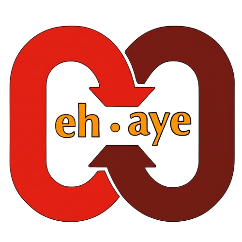

<div align="center">
  
  ## ehAye™ Engine (bTc) - Between the Clicks
  
  
  
  <p>A complete web portal for your AI Automation with Vision and Control</p>
  
  [](https://github.com/neekware/btc/actions/workflows/ci.yml)
  [](https://www.typescriptlang.org/)
  [](https://nextjs.org/)
  [](LICENSE)
  
  [Live Demo](https://btc.eh-aye.net) | [Documentation](https://docs.eh-aye.net) | [Report Bug](https://github.com/neekware/btc/issues)
  
  [](https://vercel.com/new/clone?repository-url=https%3A%2F%2Fgithub.com%2Fneekware%2Fbtc&project-name=ehaye-btc&repository-name=ehaye-btc)
</div>

---

## 🎯 What is Betsey (bTc)?

**Betsey** (Between the Clicks) is a comprehensive test target application designed to validate and showcase the capabilities of the ehAye™ Engine - an AI-powered browser automation system. This app serves as a real-world testing ground for automation tools, providing diverse UI components and interaction patterns.

### Why "Between the Clicks"?

In the world of browser automation, the magic happens between the clicks - the waiting, the validation, the smart decision-making. Betsey provides the perfect playground to test these nuanced interactions.

## ✨ Key Features

- 🤖 **AI-Ready**: Designed specifically for AI automation testing
- 🎨 **Modern Stack**: Next.js 15, React 19, Tailwind CSS v4
- 🌓 **Theme Support**: Beautiful dark/light themes with smooth transitions
- 📱 **Fully Responsive**: Works on all devices and screen sizes
- ⚡ **Optimized Performance**: Fast loading and smooth interactions
- 🧪 **Comprehensive Tests**: Every UI pattern you need to test

## 🚀 Quick Start

```bash
# Clone the repository
git clone https://github.com/neekware/btc.git
cd btc

# Install dependencies
pnpm install

# Start development server
pnpm dev
```

Visit `http://localhost:3333` to see Betsey in action!

## 🧩 Test Scenarios

### Input Tests

- 📝 **Text Inputs** - All input types, validations, and edge cases
- 📋 **Form Submit** - Complex forms with various submission patterns
- ✅ **Checkboxes** - Single, groups, indeterminate states
- 🔘 **Radio Buttons** - Groups, default selections, dynamic options
- 📊 **Dropdowns** - Native selects, custom dropdowns, multi-select
- 🎚️ **Sliders & Range** - Value ranges, steps, and constraints

### Interaction Tests

- 🖱️ **Click Events** - Buttons, links, and clickable elements
- ✨ **Hover Effects** - Mouse interactions and tooltips
- 🎯 **Focus & Blur** - Tab navigation and focus management
- 📜 **Scrolling** - Infinite scroll, scroll-to-top, parallax
- 🧭 **Navigation** - Routing, breadcrumbs, and menus
- 🔍 **Search** - Real-time search with debouncing

### Quick Test Elements

Try these interactive elements right on the home page:

- **Click Me** - Test basic click handling
- **Secondary** - Alternative action testing
- **Destructive** - Confirmation dialogs
- **Outline** - Different button styles
- **Ghost** - Subtle interactions

## 📚 Documentation

### Project Structure

```
btc/
├── src/
│   ├── app/           # Next.js App Router
│   ├── pages/         # Page components
│   ├── components/    # UI components
│   │   ├── ui/        # Base components
│   │   └── ...        # Feature components
│   ├── lib/           # Utilities
│   ├── hooks/         # Custom hooks
│   └── styles/        # Global styles
├── public/            # Static assets
├── scripts/           # Build tools
└── .github/           # CI/CD workflows
```

### Available Scripts

```bash
# Development
pnpm dev          # Start dev server (port 3333)
pnpm build        # Build for production
pnpm start        # Start production server

# Code Quality
pnpm lint         # Check code issues
pnpm lint:fix     # Fix code issues
pnpm format       # Format code
pnpm typecheck    # Type checking

# Utilities
pnpm clean        # Clean build files
```

## 🤖 Using with ehAye™ Engine

Betsey is designed to work seamlessly with the ehAye™ Engine MCP (Model Context Protocol) for browser automation:

```javascript
// Example automation script
await ehaye.navigate("https://btc.eh-aye.net");
await ehaye.click("text=Text Inputs");
await ehaye.fill("#username", "test@example.com");
await ehaye.press("Tab");
await ehaye.type("SecurePassword123!");
await ehaye.click('button[type="submit"]');
```

## 🛠️ Tech Stack Details

- **Framework**: Next.js 15.5 with Pages Router
- **UI Library**: React 19.1
- **Styling**: Tailwind CSS v4 (oklch colors)
- **Components**: Custom components with Radix UI
- **Animations**: Framer Motion
- **Icons**: Lucide React
- **Type Safety**: TypeScript 5.9
- **Code Quality**: ESLint, Prettier, Husky

## 🤝 Contributing

We welcome contributions! Please follow these steps:

1. Fork the repository
2. Create your feature branch (`git checkout -b feat/amazing-feature`)
3. Commit changes (`git commit -m 'feat: add amazing feature'`)
4. Push to branch (`git push origin feat/amazing-feature`)
5. Open a Pull Request

### Commit Convention

- `feat:` New features
- `fix:` Bug fixes
- `docs:` Documentation
- `style:` Code style changes
- `refactor:` Code refactoring
- `test:` Test changes
- `chore:` Maintenance

## 📄 License

MIT License - see [LICENSE](LICENSE) for details

## 🙏 Acknowledgments

- Built with ❤️ by [Neekware Inc.](https://neekware.com)
- Built for [ehAye™ Engine](https://eh-aye.net)
- Powered by `React.js`, `Next.js`, `TailwindCss`, `ShadCN` and more ...

## 📞 Get in Touch

- 🌐 Website: [eh-aye.net](https://eh-aye.net)
- 🐛 Issues: [GitHub Issues](https://github.com/neekware/btc/issues)

---

<div align="center">
  <p>
    <strong>ehAye™ Engine</strong> - AI Automation with Vision and Control
  </p>
  <p>
    © 2006-2025 Neekware Inc. All rights reserved.
  </p>
</div>
